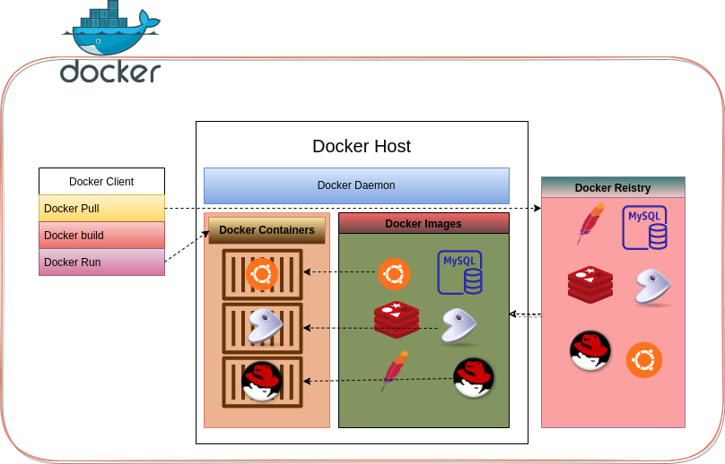

**What is Docker ?**  
Docker is a set of platform as a service products that use OS-level virtualization to deliver software in packages called containers.

**Docker Architecture:**
Docker Follows a Client-Server Architecture and the 3 main components of Docker are as follows.

 1. Docker Client(CLI)
 2. Docker Host(Server)
 3. Docker Registry

**Docker Client** is the interface used by the developers to create the containers and the client uses commands and REST API to communicate with the Server.

**The Docker Host** will enable the necessary environment for the developer to create applications and the host consists of docker daemon, images, containers, networks, and storage.

**The Docker Registry** will store and manages the docker images. Docker Registry is of two types, Public and Private. Public repositories are accessible by everyone where as Private repositories are used by the organisations for their own purposes.

What are the types of Docker Objects ?
The list of Docker Objects are as follows.

 - [ ] Docker Images
 - [ ] Docker Containers
 - [ ] Docker Networking
 - [ ] Docker Storage

**Docker Images** are Read-Only binary templates used for creating containers. 
 
A **Docker Container** is a light weight, standalone and  executable package that contains all the application dependencies.

**Docker Networking** is one of the objects of Docker, and it is used for communication between the standalone applications running in the containers. Types of Network Drivers are :

 - **Bridge**: It is default network driver, and it allows multiple docker to communicate with the same host.
 - **Host**: It is used when we don't need any restrictions between the container and the Host.
 - **None**: Disables all the Networking.
 - **Overlay**: Overlay is used in the Docker Swarm. This allows multiple docker swarm services to communicate with each other.
 - **Macvlan**: Macvlan is used when we want to assign Mac address to each containers.
 
 **Docker Storage** is one of the docker objects which is used in maintaining the application data in the container. As we know that the data inside the container is non-persistent and Docker Storage concept helps us maintaining data even when the container is destroyed.
 Types of Docker Storage Options are:
 - **Data Volume:** gives us  the ability to create a Persistent Volumes.
 - **Directory Mounts:**  it gives us  the ability to mount the directory on host to be attached to container.
 - **Storage Plugins:** Storage plugins gives us the ability to use external storage providers.
